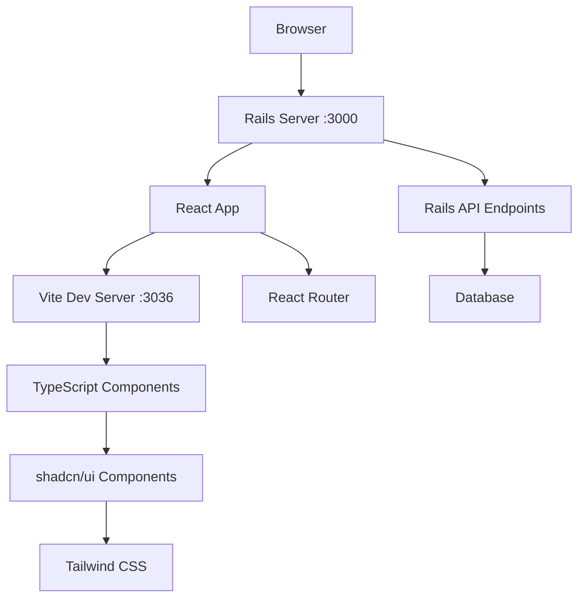

# Project Architecture Documentation

## Overview

This document provides detailed architectural information about the React Starter Kit project, including design decisions, patterns, and best practices.

## System Architecture

### High-Level Architecture



### Technology Stack Layers

1. **Presentation Layer**
   - React 19 with TypeScript
   - shadcn/ui component library
   - Tailwind CSS for styling
   - React Router for navigation

2. **Build & Development Layer**
   - Vite for fast development and building
   - TypeScript compiler for type checking
   - Biome for linting and formatting
   - Hot Module Replacement (HMR)

3. **Backend Layer**
   - Ruby on Rails framework
   - Puma web server
   - RESTful API structure (ready for expansion)

4. **Data Layer**
   - SQLite (development)
   - Ready for PostgreSQL/MySQL in production

## Design Patterns & Principles

### Frontend Patterns

#### 1. Component Composition
```typescript
// Example: Building complex UI from simple components
<Card>
  <CardHeader>
    <CardTitle>Title</CardTitle>
    <CardDescription>Description</CardDescription>
  </CardHeader>
  <CardContent>
    <Button variant="primary">Action</Button>
  </CardContent>
</Card>
```

#### 2. Custom Hooks Pattern
```typescript
// useTheme hook encapsulates theme logic
const { theme, toggleTheme, isInitialized } = useTheme()
```

#### 3. CSS-in-JS via CSS Variables
```css
/* Theme-aware colors */
.bg-primary {
  background-color: var(--primary);
}
```

#### 4. Path Alias Pattern
```typescript
// Clean imports using @ alias
import { Button } from '@/components/ui/button'
import { useTheme } from '@/hooks/useTheme'
```

### Backend Patterns

#### 1. Convention over Configuration
- Rails conventions for project structure
- RESTful routing patterns
- MVC architecture

#### 2. SPA Fallback Pattern
```ruby
# All HTML requests serve the React app
get "*path", to: "application#index", constraints: ->(request) { request.format.html? }
```

## Component Architecture

### Component Hierarchy

```
App (Router)
├── SimplePage
│   ├── Theme Toggle
│   ├── Navigation Buttons
│   └── Tabs
│       ├── Colors Tab
│       ├── Components Tab
│       └── Interactive Tab
├── ComponentsPage
│   └── Component Showcase
└── AnimatedPage
    └── Advanced Animations
```

### Component Categories

1. **Layout Components**
   - `Card`, `Separator`, `Tabs`
   - Handle structure and organization

2. **Form Components**
   - `Button`, `Input`, `Checkbox`, `Switch`
   - User interaction and data entry

3. **Display Components**
   - `Badge`, `Avatar`, `Alert`, `Progress`
   - Information presentation

4. **Interactive Components**
   - `Slider`, `Dialog`, `Popover`
   - Advanced user interactions

## State Management

### Current Approach
- **Local State**: React `useState` for component-specific state
- **Theme State**: Custom `useTheme` hook with localStorage persistence
- **Router State**: React Router for navigation state

### Scalability Considerations
For larger applications, consider:
- **Context API** for app-wide state
- **Redux Toolkit** for complex state management
- **React Query** for server state management

## Styling Architecture

### CSS Architecture Layers

1. **Base Layer** - Tailwind's base styles
2. **Component Layer** - shadcn/ui component styles
3. **Utility Layer** - Tailwind utility classes
4. **Custom Layer** - Project-specific styles

### Theme System

```css
/* CSS Variables for theme support */
:root {
  --background: 0 0% 100%;
  --foreground: 222.2 84% 4.9%;
  --primary: 222.2 47.4% 11.2%;
  /* ... more variables */
}

[data-theme="dark"] {
  --background: 222.2 84% 4.9%;
  --foreground: 210 40% 98%;
  --primary: 210 40% 98%;
  /* ... dark theme overrides */
}
```

## Build & Development Architecture

### Development Flow

1. **Developer writes code** in TypeScript/React
2. **Vite watches files** and provides HMR
3. **Rails serves** the application shell
4. **Browser loads** React app with hot reloading

### Production Build Flow

1. **TypeScript compilation** - Type checking
2. **Vite build** - Asset bundling and optimization
3. **Rails asset precompilation** - Integration with Rails
4. **Docker containerization** - Production deployment

### Asset Pipeline

```
Source Files (app/frontend/)
├── TypeScript/React → Vite → Bundled JS
├── CSS/Tailwind → PostCSS → Optimized CSS
└── Static Assets → Rails → Public directory
```

## Security Architecture

### Frontend Security
- **Content Security Policy** (CSP) configured in Rails
- **Modern browser requirements** for latest security features
- **Type safety** reduces runtime errors
- **Dependency scanning** via npm audit

### Backend Security
- **Rails security defaults** enabled
- **Modern browser enforcement**
- **Non-root container execution**
- **Environment variable protection**

## Performance Architecture

### Frontend Performance
- **Code splitting** via Vite
- **Tree shaking** for minimal bundle size
- **Hot Module Replacement** for fast development
- **Optimized CSS** with Tailwind purging

### Backend Performance
- **Bootsnap** for Rails boot optimization
- **Asset precompilation** for production
- **Puma web server** for concurrency
- **Docker layer optimization**

## Deployment Architecture

### Development Environment
```
Local Machine
├── Rails Server (:3000)
├── Vite Dev Server (:3036)
└── Database (SQLite)
```

### Production Environment
```
Docker Container
├── Rails + Vite Build
├── Puma Server (:80)
└── Production Database
```

### Docker Strategy
- **Multi-stage builds** for size optimization
- **Non-root user** for security
- **Health checks** for monitoring
- **Environment variable configuration**

## Testing Architecture

### Current Testing Setup
- **TypeScript compilation** for type checking
- **Biome linting** for code quality
- **Git hooks** for pre-commit validation

### Recommended Testing Additions
- **Jest** for unit testing
- **React Testing Library** for component testing
- **Cypress** for end-to-end testing
- **RSpec** for Rails backend testing

## Monitoring & Observability

### Built-in Monitoring
- **Rails health check** endpoint (`/up`)
- **Browser dev tools** for frontend debugging
- **Vite dev server** logging
- **Rails server** logging

### Production Monitoring Recommendations
- **Application monitoring** (New Relic, DataDog)
- **Error tracking** (Sentry, Bugsnag)
- **Performance monitoring** (Web Vitals)
- **Log aggregation** (ELK stack, Splunk)

## Future Architecture Considerations

### Scalability Improvements
1. **API Layer** - Separate Rails API from frontend
2. **Microservices** - Split functionality into services
3. **CDN Integration** - Optimize asset delivery
4. **Caching Strategy** - Redis for session/cache storage

### Technology Upgrades
1. **React Server Components** - When stable
2. **Next.js Integration** - For advanced SSR needs
3. **Database Migration** - PostgreSQL for production
4. **Container Orchestration** - Kubernetes for scale

## Conclusion

This architecture provides a solid foundation for modern web applications with:
- **Developer Experience** - Fast feedback loops and modern tooling
- **Maintainability** - Clear separation of concerns and conventions
- **Scalability** - Ready for growth and feature additions
- **Performance** - Optimized for both development and production
- **Security** - Modern security practices and safeguards
